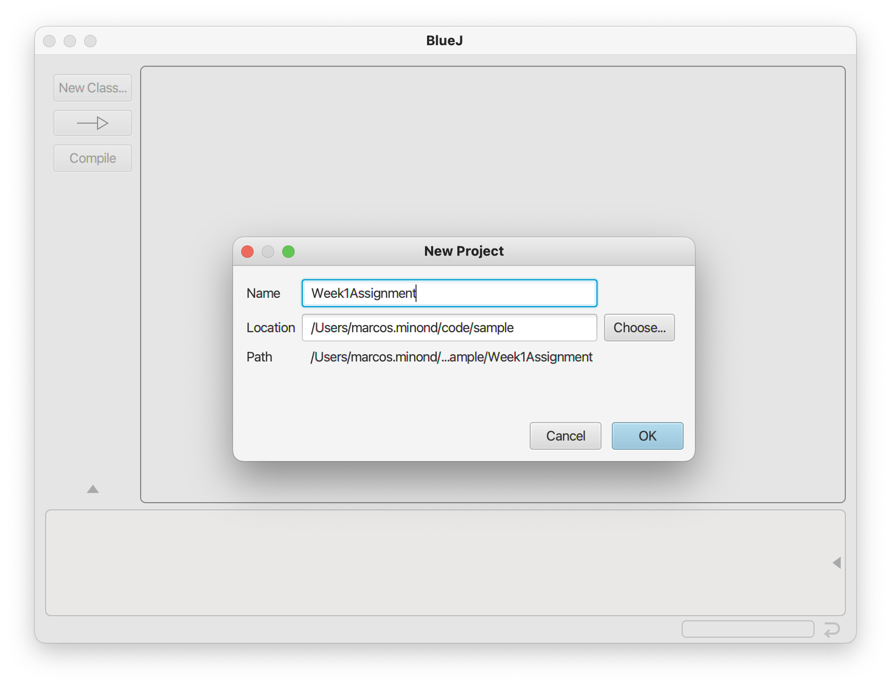
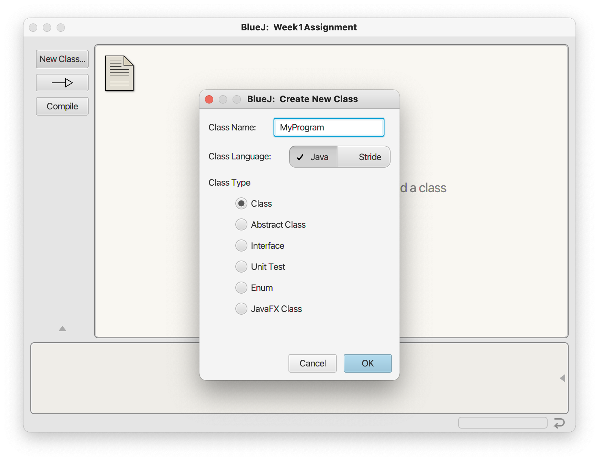
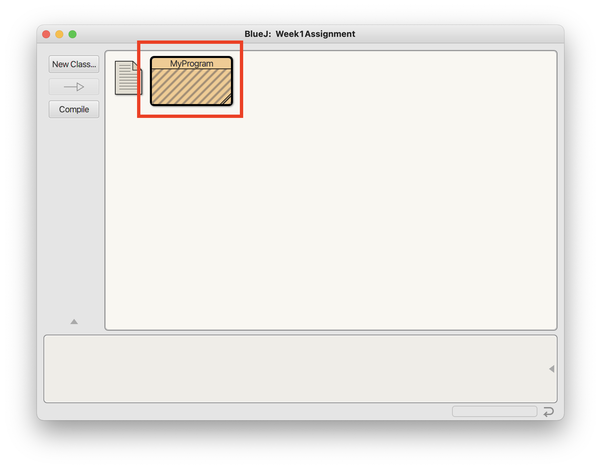
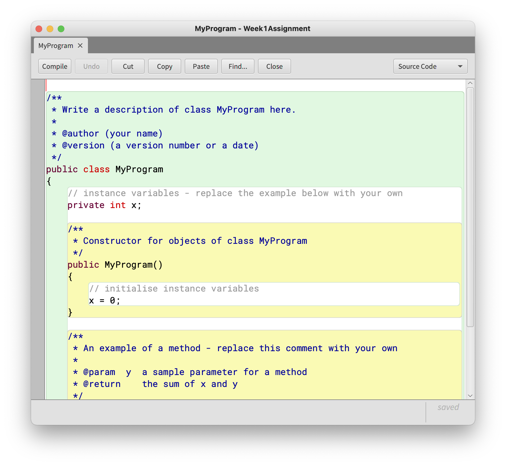
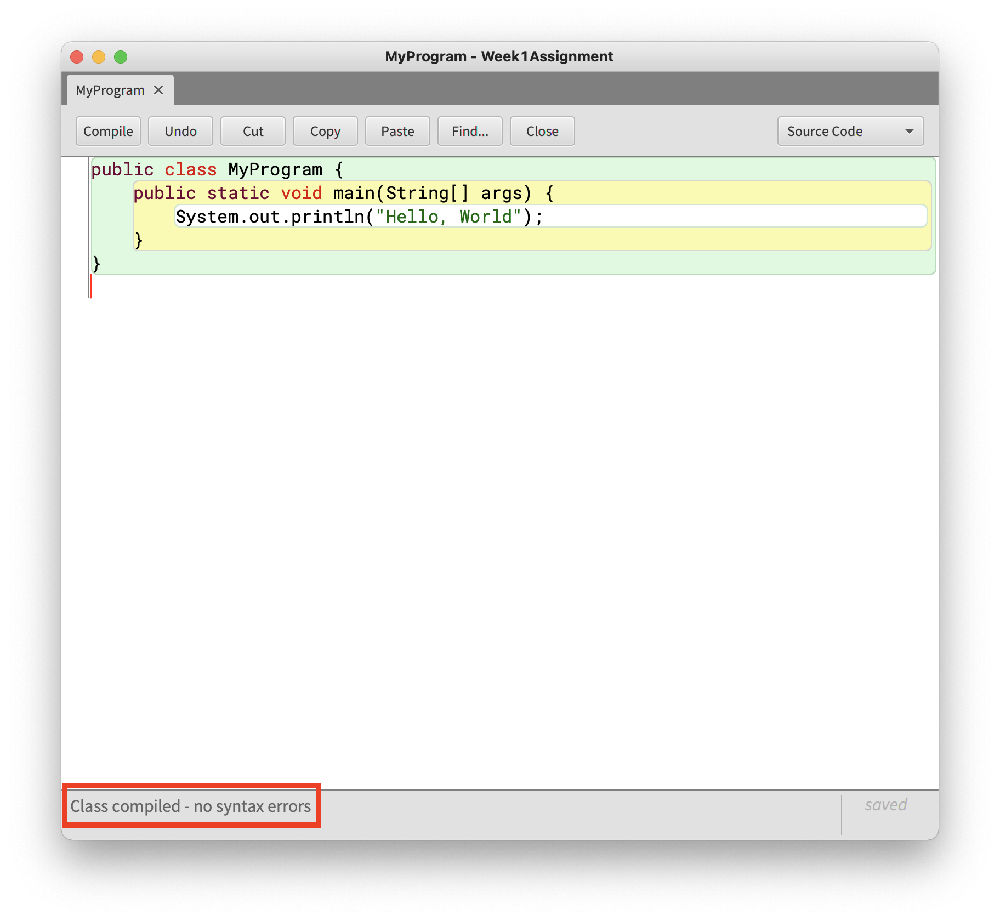
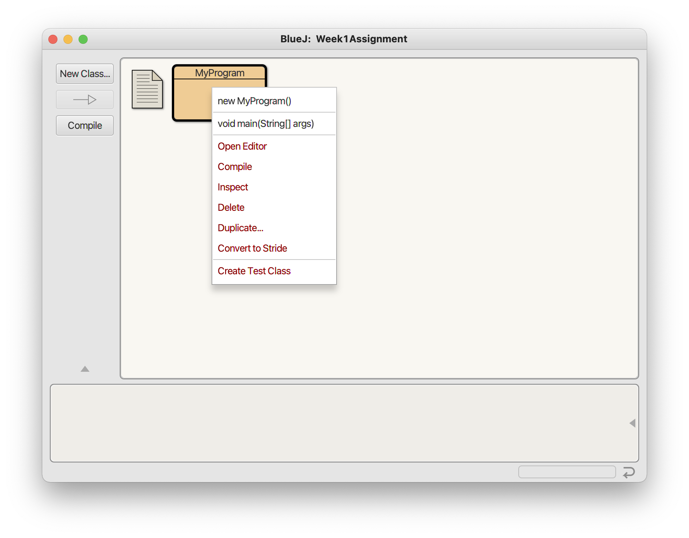
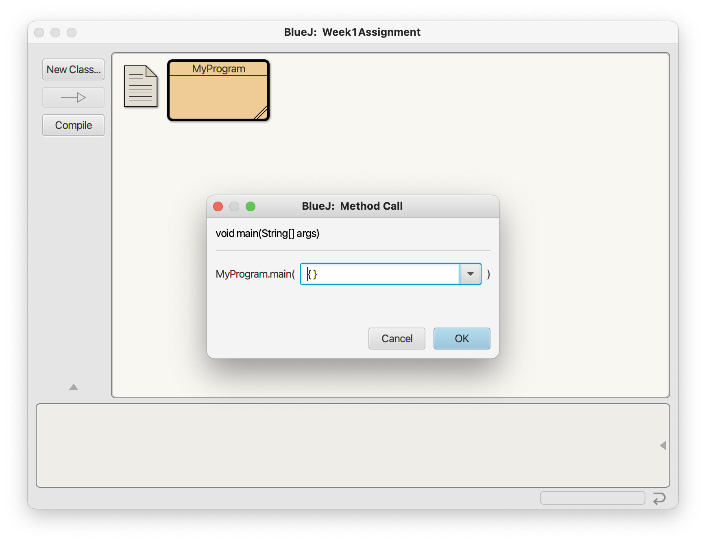
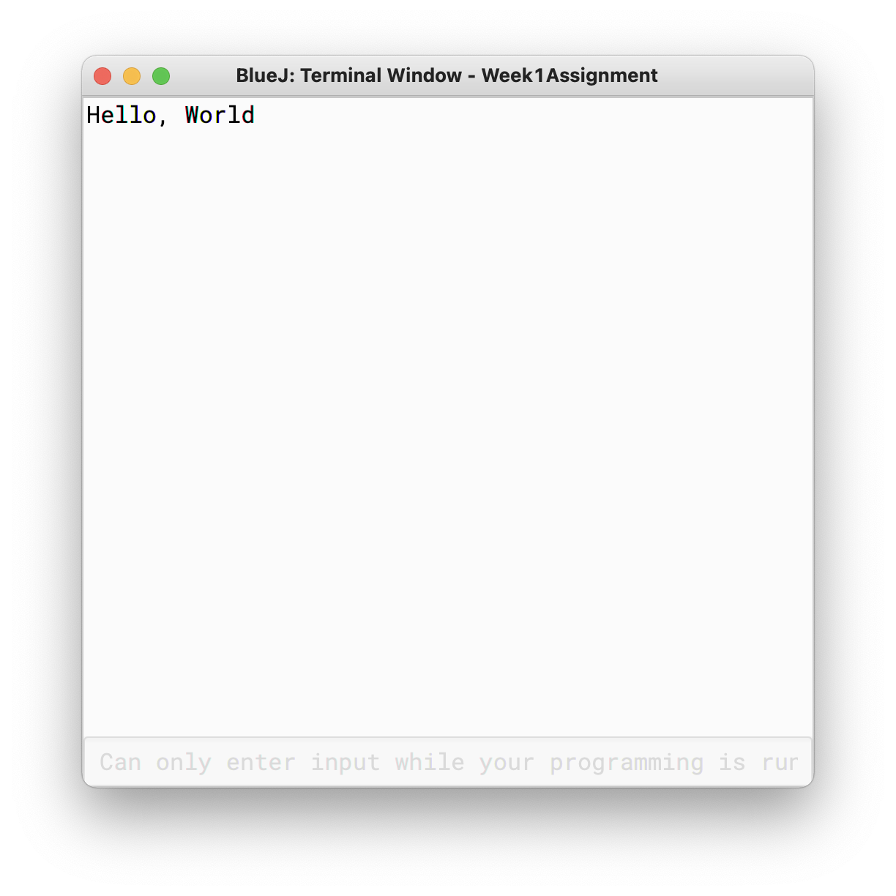

# Week 1 Assignment

In addition to answering the questions below and completing the projects, you should read Chapter 1 of Java Programming: From the Ground Up. The reading will help you answer all of the questions.

1. What is a computer? (1 point)
2. What does a CPU do? (1 point)
3. When the CPU executes a program, where are the program instructions and the program's data stored? (1 point)
4. What is an IO device? (1 point)
5. Give three examples of an IO device. (1 point)
      - &nbsp;
      - &nbsp;
      - &nbsp;
6. Give two examples of an operating system. (1 point)
      - &nbsp;
      - &nbsp;
7. What is "machine language"? (1 point)
8. What does "JVM" stand for? For example, "ASAP" stands for "As Soon As Possible". (1 point)
9. What is an algorithm? (1 point)


## Project: Download and install BlueJ

Go to https://www.bluej.org and download the installer for your operating system. Once downloaded, install and ensure you are able to run BlueJ.


## Project: Run your first Java program

Open BlueJ and follow the instructions below:

1. Select the "Project" menu item.
2. Click on "New Project"
3. Name your project "Week1Assignment". 
4. Click on "New Class" on the side menu.
5. Name your class "MyProgram" and keep the other options as they are. 
6. You should see the class you just created represented as rectangular object in BlueJ. 
7. Double click on the class you just created to view and edit its contents. 
8. Replace all of the code with this code:
```
      public class MyProgram {
          public static void main(String[] args) {
              System.out.println("Hello, World");
          }
      }
```
8. Click on the "Compile" button at the bottom of the editor screen. Ensure there are no errors. 
9. Go back to the main BlueJ window and right click on the "MyProgram" class rectangle. 
10. Click on `void main(String[] args)` from this menu.
11. Leave the argument value as is and click "OK". 
12. Ensure the Terminal window opens and you see the text "Hello, World" 
