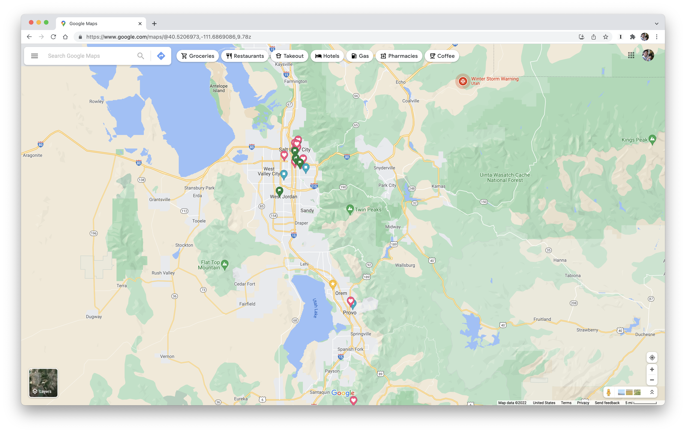
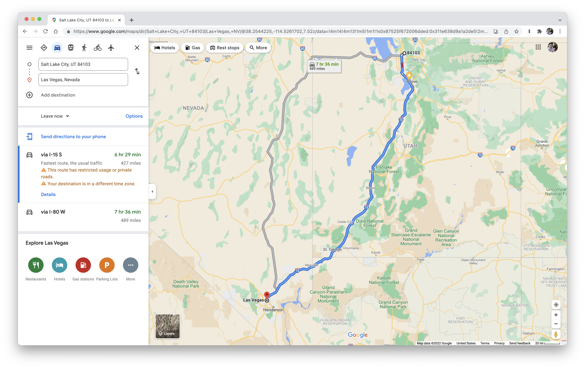
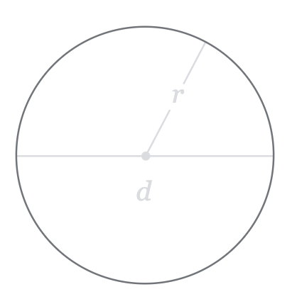
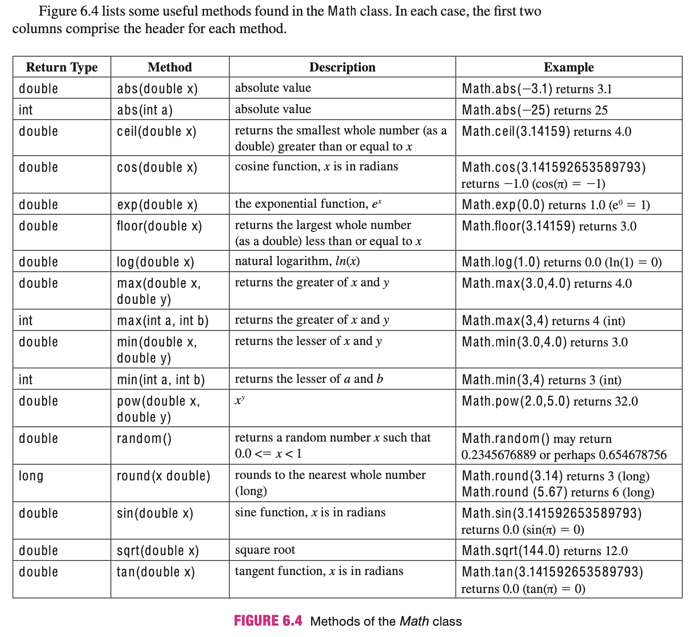

# Java Programming Foundations 1

### Week 7: Methods

---

## Overview

<span class="centered narrow">

- A little bit of math with formulas
- A little bit of Java with methods
- Syntax
- Return results
- Scope
- Overloading
- Predefined methods

</span>

---

<!-- paginate: true -->

# A little bit of math with formulas

---

## Estimate how much time it will take to drive somewhere



---

## How can we estimate how much time it will take to drive somewhere?


---

## Formula to estimate how much time it will take<br>to drive somewhere (1)

$$ drive\ time\ in\ hours = distance\ in\ miles\ /\ average\ miles\ per\ hour $$

---

## Formula to estimate how much time it will take<br>to drive somewhere (2)

$$ drive\ time\ in\ hours = \frac{distance\ in\ miles}{average\ miles\ per\ hour} $$

---

## Formula to estimate how much time it will take<br>to drive somewhere (3)

$$ drive\ time = \frac{distance}{average\ mph} $$

---

## Estimate how much time it will take to drive to Las Vegas



---

## Estimate how much time it will take to drive to Las Vegas

$$
\begin{align}
distance & = 427\ miles                   \nonumber \\
average\ mph & = 65\ mph                  \nonumber \\
                                          \nonumber \\
drive\ time & = distance\ /\ average\ mph \nonumber \\
                                          \nonumber \\
                                          \nonumber \\
\end{align}
$$

---

## Estimate how much time it will take to drive to Las Vegas

$$
\begin{align}
distance & = 427\ miles                   \nonumber \\
average\ mph & = 65\ mph                  \nonumber \\
                                          \nonumber \\
drive\ time & = distance\ /\ average\ mph \nonumber \\
& = 427\ /\ 65                            \nonumber \\
                                          \nonumber \\
\end{align}
$$

---

## Estimate how much time it will take to drive to Las Vegas

$$
\begin{align}
distance & = 427\ miles                   \nonumber \\
average\ mph & = 65\ mph                  \nonumber \\
                                          \nonumber \\
drive\ time & = distance\ /\ average\ mph \nonumber \\
& = 427\ /\ 65                            \nonumber \\
& \approx 6.6\ hours                      \nonumber \\
\end{align}
$$

---

## Calculate the area of a circle



---

## How can we calculate the area of a circle?


---

## Formula to calculate the area of a circle (1)

$$ area = \pi\cdot{}radius^2 $$

---

## Formula to calculate the area of a circle (2)

$$ area = \pi{}r^2 $$

---

## Calculate the area of a circle with a radius of 10 feet

$$
\begin{align}
radius & = 10\ feet         \nonumber \\
                            \nonumber \\
area & = \pi\cdot{}radius^2 \nonumber \\
                            \nonumber \\
                            \nonumber \\
                            \nonumber \\
\end{align}
$$

---

## Calculate the area of a circle with a radius of 10 feet

$$
\begin{align}
radius & = 10\ feet         \nonumber \\
                            \nonumber \\
area & = \pi\cdot{}radius^2 \nonumber \\
& = \pi\cdot{}10^2          \nonumber \\
                            \nonumber \\
                            \nonumber \\
\end{align}
$$

---

## Calculate the area of a circle with a radius of 10 feet

$$
\begin{align}
radius & = 10\ feet         \nonumber \\
                            \nonumber \\
area & = \pi\cdot{}radius^2 \nonumber \\
& = \pi\cdot{}10^2          \nonumber \\
& = \pi\cdot{}100           \nonumber \\
                            \nonumber \\
\end{align}
$$

---

## Calculate the area of a circle with a radius of 10 feet

$$
\begin{align}
radius & = 10\ feet         \nonumber \\
                            \nonumber \\
area & = \pi\cdot{}radius^2 \nonumber \\
& = \pi\cdot{}10^2          \nonumber \\
& = \pi\cdot{}100           \nonumber \\
& \approx 314.1             \nonumber \\
\end{align}
$$

---

# A little bit of Java with methods

---

## Keep the following idea in your mind as we proceed

<p class="text narrow">Methods allow you to have reusable code.</p>

---

## Keep the following idea in your mind as we proceed

<p class="text narrow">Methods allow you to abstract your code.</p>

---

## Let's start with two samples

<div class="centered narrow">

- Declaring methods
- Calling methods

</div>

---

## Sample method declaration

```java
public static void main(String[] args)
{
    // Method block, your code goes here
}
```

---

## Sample method call

```java
System.out.println("this is how to call a method in Java");
```

---

# Syntax

---

## The `main` method

```
            Return type
 Modifiers     |               Parameters
 |     \       |   Name          |
 |      \      |    |            |
 |       |     |    |            |
 V       V     V    V            V
public static void main(String[] args)
{
                                         <--+
                                            |
                                            |--- Method block
                                            |
                                         <--+
}
```

---

## Different name, multiple parameters

```
            Return type
 Modifiers     |               Parameters
 |     \       |   Name          |
 |      \      |    |            |
 |       |     |    |            |
 V       V     V    V            V
public static int anotherName(String name, int age)
{
                                         <--+
                                            |
                                            |--- Method block
                                            |
                                         <--+
}
```

---

# Let's write some code

---

## Estimate how much time it will take to drive to Las Vegas

$$
\begin{align}
distance & = 427\ miles                   \nonumber \\
average\ mph & = 65\ mph                  \nonumber \\
                                          \nonumber \\
drive\ time & = distance\ /\ average\ mph \nonumber \\
& = 427\ /\ 65                            \nonumber \\
& \approx 6.6\ hours                      \nonumber \\
\end{align}
$$

---

```java
public class CalculateEstimatedDriveTime
{
    public static void main(String[] args)
    {
        double distance = 427;
        double mph = 65;
        calcuateEstimatedDriveTime(distance, mph);
    }

    public static void calcuateEstimatedDriveTime(double distance, double mph)
    {
        double driveTime = distance / mph;
        System.out.println("Your estimated drive time is " + driveTime + " hours");
    }
}
```

---

# Let's write some code

---

## Birthday card message generator

<p class="text narrow">"[name], congratulations on turning [age]. Here's to another year of being best friends!"</p>

---

```java
public class BirthdayCardMessageGenerator
{
    public static void main(String[] args)
    {
        String name = "Marcos";
        int age = 33;
        generateBirthdayCardMessage(name, age);
    }

    public static void generateBirthdayCardMessage(String name, int age)
    {
        System.out.println(name + ", congratulations on turning " + age +
          ". Here's to another year of being best friends!");
    }
}
```

---

## How does this help me?

<div class="centered narrow">

- Methods are reusable: you can easily call them multiple times
- Methods are parameterized: you can call them with different parameters (more on this later)

</div>

---

## Reusable and parameterized

```java
generateBirthdayCardMessage("Ryan", 40);
generateBirthdayCardMessage("Alec", 36);
generateBirthdayCardMessage("Sean", 37);
```

---

## A life without methods

```java
public class BirthdayCardMessageGenerator
{
    public static void main(String[] args)
    {
        String name1 = "Ryan";
        int age1 = 40;
        System.out.println(name1 + ", congratulations on turning " + age1 +
          ". Here's to another year of being best friends!");

        String name2 = "Alec";
        int age2 = 36;
        System.out.println(name2 + ", congratulations on turning " + age2 +
          ". Here's to another year of being best friends!");

        String name3 = "Sean";
        int age3 = 37;
        System.out.println(name3 + ", congratulations on turning " + age3 +
          ". Here's to another year of being best friends!");
    }
}
```

---

## A life with methods

```java
public class BirthdayCardMessageGenerator
{
    public static void main(String[] args)
    {
        generateBirthdayCardMessage("Ryan", 40);
        generateBirthdayCardMessage("Alec", 36);
        generateBirthdayCardMessage("Sean", 37);
    }

    public static void generateBirthdayCardMessage(String name, int age)
    {
        System.out.println(name + ", congratulations on turning " + age +
          ". Here's to another year of being best friends!");
    }
}
```

---

## The syntax, again

```
            Return type
 Modifiers     |               Parameters
 |     \       |   Name          |
 |      \      |    |            |
 |       |     |    |            |
 V       V     V    V            V
public static int anotherName(String name, int age)
{
                                         <--+
                                            |
                                            |--- Method block
                                            |
                                         <--+
}
```

---

## The method block

```
public static int anotherName(String name, int age)
{
                                         <--+
                                            |
                                            |--- Method block
                                            |
                                         <--+
}
```

---

## The modifiers

```
 Modifiers
 |     \
 |      \
 |       |
 V       V
public static int anotherName(String name, int age)
{
}
```

---

## The modifiers

<p class="text narrow">There are additional modifiers other than <code>public</code> and <code>static</code>, but for today's class we will only use <code>public</code> and <code>static</code>.</p>

---

## The name

```
                   Name
                    |
                    |
                    V
public static int anotherName(String name, int age)
{
}
```

---

## The name

<p class="text narrow">Method names follow the same rules as variable names.</p>

---

## The name

<p class="quote">A valid Java identifier is a “word” of arbitrary length composed of letters and/or digits and/or two special characters $ (dollar sign) and _ (underscore), where the first character must be a letter.
<span class="quote-source">Java Programming: From the Ground Up, page 25</span>
</p>

---

## The parameters

```
                               Parameters
                                 |
                                 |
                                 |
                                 V
public static int anotherName(String name, int age)
{
}
```

---

## The parameters

<div class="centered narrow">

- Parameters are optional
- Parameters must specify their "type"
- Parameters are only available in the method's block.<br>More on this later

</div>

---

## The return type

```
            Return type
               |
               |
               |
               |
               V
public static int anotherName(String name, int age)
{
}
```

---

## The return type

<p class="text narrow">The return type specifies the "type" of the value that the method "returns" to the "caller".</p>

---

## The return type specifies the "type" of the value that the method "returns" to the "caller".

<p class="w100 tal text"><b>Returns:</b> a method is able to "hand back" the result. This is referred to as "retuning" in Java. Think of this as the answer from the method. More on this coming.</p>
<p class="w100 tal text pt1 pb1"><b>Type:</b> refers to the type of the value being returned by this method, This is the same as the type you've used in variables, such as <code>int</code>, <code>double</code>, <code>String</code>, etc.</p>
<p class="w100 tal text"><b>Caller:</b> the caller is the code that called the method. More on this coming.</p>

---

## Returning nothing

<p class="text narrow"><code>void</code> means that this method does not return anything. <code>void</code> is the type which represents a lack of a value.</p>

---

## Returning nothing

```java
public class CalculateEstimatedDriveTime
{
    /* ... main method omitted ... */

    public static void calcuateEstimatedDriveTime(double distance, double mph)
    {
        double driveTime = distance / mph;
        System.out.println("Your estimated drive time is " + driveTime + " hours");
    }
}
```

---

## Returning a value

<p class="text narrow">If instead we want to return a value, we need to specify the type of the value being returned and "return" it with the <code>return</code> keyword.</code>

---

## Estimate how much time it will take to drive to Las Vegas

```java
public class CalculateEstimatedDriveTime
{
    /* ... main method omitted ... */

    /*
    public static void   calcuateEstimatedDriveTime(double distance, double mph)
    */
    public static double calcuateEstimatedDriveTime(double distance, double mph)
    {
        double driveTime = distance / mph;
        return driveTime;
    }
}
```

---

## The `return` keyword

<div class="centered narrow">

- Specifies the value that is returned to the caller
- Terminates the execution of the current method

</div>

---

## Multiple `return` statements

```java
public class CardMessageGenerator
{
    public static void main(String[] args)
    {
        String message = generateCardMessage("Ryan", 39, false);
        System.out.println(message);
    }

    public static String generateCardMessage(String name, int age, boolean isBirthday)
    {
        if (isBirthday) {
            return name + ", congratulations on turning " + age + "!";
        } else {
            return name + ", thanks for being such a good friend!";
        }
    }
}
```

---

## The return type

<p class="text narrow">Note that the return type specified in the method must match the type of the value being returned in the method block.</p>

---

## Think in terms of inputs and outputs

<div class="centered narrow">

- The parameters are the inputs
- The returned value is the output

</div>

---

## Caller

```java
public class CalculateEstimatedDriveTime
{
    public static void main(String[] args)
    {
        double distance = 427;
        double mph = 65;
        double driveTime = calcuateEstimatedDriveTime(distance, mph);
        System.out.println("Your estimated drive time is " + driveTime + " hours");
    }

    public static double calcuateEstimatedDriveTime(double distance, double mph)
    {
        double driveTime = distance / mph;
        return driveTime;
    }
}
```

---

# Let's write some code

---

## Calculate the area of a circle with a radius of 10 feet

$$
\begin{align}
radius & = 10\ feet         \nonumber \\
                            \nonumber \\
area & = \pi\cdot{}radius^2 \nonumber \\
& = \pi\cdot{}10^2          \nonumber \\
& = \pi\cdot{}100           \nonumber \\
& \approx 314.1             \nonumber \\
\end{align}
$$

---

```java
public class AreaOfACircle
{
    public static void main(String[] args)
    {
        double radius = 10;
        double area = calculateAreaOfACircle(radius);
        System.out.println("The area of a circle with a radius of " + radius +
            " feet equals " + area + " squared feet");
    }

    public static double calculateAreaOfACircle(double radius)
    {
        return Math.PI * Math.pow(radius, 2);
    }
}
```

---

# Scope and local variables

---

## Sample of a local variable

```java
public class LocalVariablesSample
{
    public static void main(String[] args)
    {
        String name = "Marcos";
        System.out.println(name);
    }

    public static void firstWithLocalVariables()
    {
        String message = "Hi, and welcome to Java!";
        System.out.println(message);
    }
}
```

---

## Scope and local variables

<p class="text narrow">Local variables that are declared in a method block are only able to be used inside of that method.</p>

---

## Scope and local variables

<p class="text narrow">This is known as a variable's scope.</p>

---

## Local variables are only able to be used inside of the method block

```java
public class LocalVariablesSample
{
    public static void firstWithLocalVariables()
    {
        String message = "Hi, and welcome to Java!";
        System.out.println(message);
    }

    public static void secondWithLocalVariables()
    {
        String favoriteNumber = 27;
        System.out.println(favoriteNumber);
    }
}
```

---

## Same name, different method

```java
public class LocalVariablesSample
{
    public static void firstWithLocalVariables()
    {
        String message = "Hi, and welcome to Java!";
        System.out.println(message);
    }

    public static void secondWithLocalVariables()
    {
        String message = "Have a great day!";
        System.out.println(message);
    }
}
```

---

## Method parameters behave just like local variables

```java
public class BirthdayCardMessageGenerator
{
    public static void main(String[] args)
    {
        String name = "Marcos";
        int age = 33;
        generateBirthdayCardMessage(name, age);
    }

    public static void generateBirthdayCardMessage(String name, int age)
    {
        System.out.println(name + ", congratulations on turning " + age +
          ". Here's to another year of being best friends!");
    }
}
```

---

# Let's write some code

---

## Write a method called `greaterThan10` that returns true when a number is greater than 10

```java
greaterThan10(-1);   // Should return false
greaterThan10(3);    // Should return false
greaterThan10(10);   // Should return false
greaterThan10(43);   // Should return true
greaterThan10(6540); // Should return true
```

---

```java
public class GreaterThanSample
{
    public static void main(String[] args)
    {
        System.out.println(greaterThan10(-1));
        System.out.println(greaterThan10(3));
        System.out.println(greaterThan10(10));
        System.out.println(greaterThan10(43));
        System.out.println(greaterThan10(6540));
    }

    public static boolean greaterThan10(int number)
    {
        return number > 10;
    }
}
```

---

# Let's write some code

---

## Write a method called `sum` that returns the sum of two numbers

```java
sum(43, 43);    // 86
sum(3, 543);    // 546
sum(10, 1);     // 11
sum(43, 65);    // 108
sum(6540, 54);  // 6594

```

---

```java
public class SumSample
{
    public static void main(String[] args)
    {
        System.out.println(sum(43, 43));
        System.out.println(sum(3, 543));
        System.out.println(sum(10, 1));
        System.out.println(sum(43, 65));
        System.out.println(sum(6540, 54));
    }

    public static int sum(int num1, int num2)
    {
        return num1 + num2;
    }
}
```

---

# Overloading

---

## Overloading?

<p class="text narrow">Overloading, or method overloading, is the act of declaring multiple methods with the same name but different number of parameters or different parameter types.</p>

---

# Let's write some code

---

## Card message generator

<div class="centered narrow">

- "[name] thanks for being such a good friend!"
- "[name], congratulations on turning [age]!"

</div>

---

```java
public class CardMessageGenerator
{
    public static void main(String[] args)
    {
        System.out.println(generateCardMessage("Marcos"));
        // Marcos, thanks for being such a good friend!

        System.out.println(generateCardMessage("Marcos", 33));
        // Marcos, congratulations on turning 33!
    }

    public static String generateCardMessage(String name)
    {
        return name + ", thanks for being such a good friend!";
    }

    public static String generateCardMessage(String name, int age)
    {
        return name + ", congratulations on turning " + age + "!";
    }
}
```

---

## Method overloading, let's zoom in

```java
public class BirthdayCardMessageGenerator
{
    public static String generateCardMessage(String name) { /* ... */ }
    public static String generateCardMessage(String name, int age) { /* ... */ }
}
```

---

## Method headers

<p class="quote">
A method is described by its header, which has the following form:
<br>
<code>return-type name(parameter-list)</code>.
<span class="quote-source">Java Programming: From the Ground Up, page 194</span>
</p>

---

## Method headers

<div class="centered narrow">

- `String generateCardMessage(String name)`
- `String generateCardMessage(String name, int age)`

</div>

---

## Limitations on overloading

<p class="text narrow">Note that you cannot overload on the return type.</p>

---

# Predefined methods

---

## Useful math methods in Java

<p>(See next slide)
<span class="quote-source">Java Programming: From the Ground Up, page 195</span>
</p>

---



---

## Useful math methods in Java

```java
public class MathMethodsSample
{
    public static void main(String[] args)
    {
        System.out.println( Math.min(123, 54) );    // 54
        System.out.println( Math.max(123, 54) );    // 123
        System.out.println( Math.pow(10, 2) );      // 100.0
        System.out.println( Math.random() );        // 0.5472084750229163
        System.out.println( Math.round(Math.PI) );  // 3
    }
}
```

---

## Hint

<p class="text narrow">You're going to need to use the <code>Math.sqrt</code> method to get the square root for one of the question in this week's homework.</p>

---

## Hint

<p class="text narrow">When speaking about arithmetic, product means multiplication.</p>
